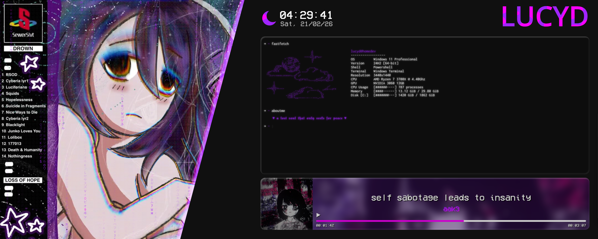

# Lucyd Cyberia

A lucyd wallpaper made for wallpaper engine with many customization options. Should work with the most resolutions and aspect ratios for desktop (eg. 16/9, 21/9, 4/3 and more).

Download and install it through the [Steam Workshop](https://steamcommunity.com/sharedfiles/filedetails?id=) or look at the source code over on [Github](https://github.com/lucyd-dev/lucyd-cyberia-wallpaper).

If you like my work, I would love if u leave a like/rating 💜

## 🛠️ Customization

You can change your preferred colors, edit the name and almost all options in the terminals. It also shows your current media playing with a neat little titlebar.

> [!NOTE]
>But keep in mind its not perfect as Wallpaper Engine  does not always provide information.
>I tryed my best to compensate for it, for the best experience.

## 🤝 Contribution

If you have problems or improvements, let my now by openenig an issue on my github or her in the disscusions.

## 📄 Licence

This project is licensed under the GPLv3 License - see the [LICENSE](LICENSE) file for details.

`Made with 💜 by Lucyd since 2026`
